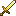
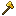
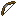
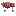
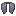
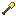
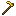
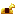

# PJ's Enchants
Enchantment Guide

## Enchantment Tiers
All custom enchantments are assigned a tier 1-3. This impacts the enchantment's rarity, with Tier 3 being the most rare. 
| Tier Color Key |
| --- |
| $\color{#77ff77}{\text{Tier I}}$ |
| $\color{#ffff77}{\text{Tier II}}$ |
| $\color{#ffaa55}{\text{Tier III}}$ |

*The Armor Score of an enchant is the sum of that enchant's level across the whole suit of armor.
# All Custom Enchantments
| Enchantment | Max Level | Item Type | Description | Calculations |
| --- | --- | --- | --- | --- |
| $\color{#77ff77}{\text{Adrenaline}}$ | 3 |  | Gain a speed boost when low on health. | Gain Speed 2 effect for (4 + level) seconds when health falls below 5HP. Is additive to any Speed effect already active. |
| $\color{#77ff77}{\text{Antidote}}$ | 4 |  | Chance to negate infliction of Poison or Wither. | |
| $\color{#ffff77}{\text{Antigravity}}$ | 3 |  | (Melee) Chance to give target levitation. (Bow) Arrows are not affected by gravity. (Boots) Double-jump to gain temporary levitation. | (Melee) 20% chance for Levitation I for (2 + level) seconds. (Boots) Double-jumping triggers Levitation (3 * level) for 2 seconds. Sneaking will cancel levitation from any source while boots are on. |
| $\color{#ffff77}{\text{Artful}}$ | 1 |  | Gain permanent Haste II while held. | |
| $\color{#ffaa55}{\text{Blaze}}$ | 3 |  | Swinging launches a small fireball. | Cooldown of (5 - level) seconds. |
| $\color{#ffff77}{\text{Bolt}}$ | 4 |  | Increases wolf speed. | Speed level matches the enchantment's level. |
| $\color{#ffaa55}{\text{Breeze}}$ | 3 |  | Swinging launches a breeze ball. | Cooldown of (5 - level) seconds. |
| $\color{#ffff77}{\text{Cluster}}$ | 3 |  | Instantly breaks clusters of blocks. | Breaks clusters of certain blocks depending on tool type in groups of up to (6 + level). |
| $\color{#77ff77}{\text{Constitution}}$ | 5 |  | Gain resistance when low on health. | Gain Resistance II for (3 + level) seconds when health falls below 7HP. |
| $\color{#77ff77}{\text{Darkness}}$ | 4 |  | Chance to blind target. | 20% chance for Blindness I for (2 + level) seconds. |
| $\color{#77ff77}{\text{Dash}}$ | 2 |  | Gain permanent Speed effect while worn. | Speed level matches the enchantment's level. |
| $\color{#ffff77}{\text{Defuse}}$ | 1 |  | Prevents creepers from exploding. | |
| $\color{#77ff77}{\text{Devour}}$ | 4 |  | Regain hunger by attacking. | Feeds player by (1.2 * damage dealt). |
| $\color{#ffff77}{\text{Discharge}}$ | 3 |  | Chance to strike yourself with lightning on hit, damaging only nearby enemies. | (5 * level)% chance to activate. |
| $\color{#77ff77}{\text{Dizzy}}$ | 3 |  | Chance to randomize target's orientation. | (5 + 5 * level)% chance to activate. Temporarily de-aggros mobs. |
| $\color{#ffaa55}{\text{Draconic}}$ | 1 |  | Arrows fired while gliding will turn into dragon fireballs. | Requires fire charges as ammunition. Costs 3 fire charges per shot. |
| $\color{#ffff77}{\text{Drag}}$ | 1 |  | Eliminates fall damage while gliding. | |
| $\color{#ffff77}{\text{Endereyes}}$ | 1 |  | Makes the wearer unable to aggravate Endermen. Sneaking while making eye contact with an Enderman will cause you to swap places. | |
| $\color{#ffff77}{\text{Escape}}$ | 1 |  | Teleport to a safe location if it while sneaking with low health. | Triggers when sneaking below 10HP. Teleported to a random safe location within 10 blocks. |
| $\color{#77ff77}{\text{Fangs}}$ | 3 |  | Increases wolf attack damage. | Damage is an additional (2HP * level). |
| $\color{#ffff77}{\text{Fling}}$ | 1 |  | Chance for wolf to toss enemy into the air. | 30% chance to activate. |
| $\color{#ffaa55}{\text{Forging}}$ | 1 |  | Automatically smelts block drops. |  |
| $\color{#77ff77}{\text{Fracture}}$ | 4 |  | Chance to deal additional damage to armor durability. | 33% chance to deal an additional (2 + level) durability to all target player's armor. (10 + 10 * level)% chance to instantly break a piece of target mob's armor. |
| $\color{#77ff77}{\text{Freezing}}$ | 3 |  | Freezes the target. | Gives target freezing status for (2 + level) seconds. |
| $\color{#77ff77}{\text{Frostbite}}$ | 5 |  | Chance to freeze the target. | 20% chance to apply Freezing for (2 + 2 * level) seconds. |
| $\color{#ffaa55}{\text{Glide}}$ | 1 |  | Gain permanent Slow Falling while worn. | |
| $\color{#ffaa55}{\text{Grappling}}$ | 1 |  | Grapples you towards arrow or pulls hit enemies towards you. | You must be in the air while the arrow hits a block to activate. Max range is 30 blocks. |
| $\color{#ffaa55}{\text{Gravity}}$ | 3 |  | Chance to send the target into the ground. | (15 + 5 * level)% chance to activate. (Melee) Swinging your weapon will also pull nearby enemies in closer. (Bow) Arrow will draw in nearby mobs. |
| $\color{#77ff77}{\text{Grounded}}$ | 1 |  | Receive less knockback and negate damage from lightning, turning it into a speed boost. | Provides immunity to Antigravity. Sneak in water to descend rapidly. |
| $\color{#77ff77}{\text{Hallucination}}$ | 3 |  | Chance to nauseate target. | 20% chance for Nausea I for (2 + level) seconds. |
| $\color{#ffff77}{\text{Healing}}$ | 1 |  | Heals hit target instead of damaging. | Healing amount increases with Power enchantment by (2 + Power level)HP and removes all negative effects. |
| $\color{#ffff77}{\text{Hellhound}}$ | 1 |  | Makes wolf immune to fire damage. | |
| $\color{#ffff77}{\text{Hellish}}$ | 1 |  | Makes horse immune to fire damage. | |
| $\color{#ffff77}{\text{Hive}}$ | 3 |  | Chance to summon a bee when hit that will target your attacker. | (3 * level)% chance to activate. |
| $\color{#ffaa55}{\text{Homing}}$ | 1 |  | Arrow will arc towards the nearest enemy. | Arrows will not arc towards friendly mobs. |
| $\color{#77ff77}{\text{Hurdle}}$ | 3 |  | Increases horse's jump strength. | Increases base jump strength attribute by (level / 4). |
| $\color{#ffff77}{\text{Infested}}$ | 3 |  | Chance to summon a silverfish when hit that will target your attacker. | (5 + 5 * level)% chance to activate. |
| $\color{#ffff77}{\text{Joust}}$ | 1 |  | Rider will deal additional melee damage and knock other riders off their horse. | Increases damage by 1.25x. |
| $\color{#77ff77}{\text{Leaping}}$ | 3 |  | Gain permanent Jump Boost. | Jump Boost level matches the enchantment's level. |
| $\color{#ffff77}{\text{Leeching}}$ | 5 |  | Chance to drain target's health. | 20% chance to activate. Heal for (20 + 10 * level)% of the damage dealt. |
| $\color{#ffff77}{\text{Lift}}$ | 2 |  | Double-jumping from the ground will launch you upwards before flight. | Upwards velocity is (1.2 * level) blocks/second. |
| $\color{#ffaa55}{\text{Lunar}}$ | 1 |  | Sneaking while gliding gives you a small boost at night. | Also works in The End. |
| $\color{#77ff77}{\text{Magnetic}}$ | 1 |  | Sneaking will pull in nearby items and metal. | Has range of (3 + #pieces) blocks. Pulls in items, arrows, and entities wearing iron armor or holding iron tools. |
| $\color{#77ff77}{\text{Molten}}$ | 3 |  | Chance to set the attacker ablaze. | (25 * #pieces)% chance to trigger, 2 + (armor score) seconds on fire. |
| $\color{#ffff77}{\text{Nighteye}}$ | 1 |  | Gain permanent night vision while worn. |  |
| $\color{#ffff77}{\text{Nightrider}}$ | 1 |  | Rider will gain permanent night vision and increased melee damage at night. | Increases damage by 1.25x. |
| $\color{#ffff77}{\text{Nitro}}$ | 5 |  | Arrows explode shortly after impact. | Arrows will explode (5 - level) seconds after impact. |
| $\color{#ffff77}{\text{Phantom}}$ | 1 |  | Increases damage when invisible. | 25% damage boost when invisible. |
| $\color{#77ff77}{\text{Plague}}$ | 5 |  | Chance to summon a poison cloud when hit. | Radius is 5 blocks. (2.5*armor score)% chance to activate. Inflicts Poison I for 5 seconds. |
| $\color{#ffaa55}{\text{Psychic}}$ | 3 |  | Chance to automatically face your attacker when hit. | (5 * level)% chance to activate. |
| $\color{#ffff77}{\text{Pulverizing}}$ | 1 |  | Permanent Haste V when held, but blocks broken will yield no drops. | |
| $\color{#77ff77}{\text{Rage}}$ | 5 |  | Gain extra strength when low on health. | Gain Strength II for (4 + level) seconds when health falls below 5HP. |
| $\color{#77ff77}{\text{Repulsion}}$ | 3 |  | Chance to launch back attackers when hit. | 33% chance to activate. Repulsion force increases with level. |
| $\color{#ffaa55}{\text{Ricochet}}$ | 3 |  | Arrows will ricochet from enemy to enemy. | Arrows will bounce up to (3 + level) times. |
| $\color{#ffff77}{\text{Rush}}$ | 3 |  | Gives the horse permanent Speed while worn. | Horse gains Speed (level). |
| $\color{#77ff77}{\text{Sealegs}}$ | 1 |  | Gain permanent Dolphin's Grace when in water. | |
| $\color{#ffaa55}{\text{Skulls}}$ | 2 |  | Right-clicking launches a wither skull. | 5s cooldown. Level 1: -45 durability. Level 2: Charged skull, -135 durability. |
| $\color{#77ff77}{\text{Snatch}}$ | 1 |  | The wolf will disarm opponents on contact. | Monsters will drop their weapons on contact. On player opponents, there is a 15% chance that the item in their main hand will switch places in their inventory. |
| $\color{#ffaa55}{\text{Solar}}$ | 1 |  | Sneaking while gliding gives you a small boost during the day. | |
| $\color{#ffff77}{\text{Spikes}}$ | 1 |  | Chance to extrude spikes when hit, damaging enemies that get too close. | 5% chance to extrude spikes for 8 seconds. Colliding with enemies will damage them 1HP every 1/2 second. |
| $\color{#ffff77}{\text{Sponge}}$ | 1 |  | Gain Resistance I when in water. | |
| $\color{#ffff77}{\text{Stealth}}$ | 3 |  | Gain invisibility while sneaking. | 5s cooldown between toggles. Different effects depending on level. Level 2: Temporarily removes your armor as well while giving you Resistance II while invisible. Level 3: Upgrades to Resistance III with the addition of Speed III. |
| $\color{#77ff77}{\text{Talent}}$ | 5 |   | Increases XP drops. | Random amount of XP dropped from blocks or mobs between 0 and (level). |
| $\color{#ffff77}{\text{Thrust}}$ | 1 |  | Fireworks will give you a greater boost when gliding. | |
| $\color{#ffaa55}{\text{Thunder}}$ | 4 |  | Chance to strike target with lightning | (5 + 5 * level)% chance to activate |
| $\color{#77ff77}{\text{Toxic}}$ | 1 |  | Poisons attackers. | Gives attackers poison 2 for 2 + (armor score) seconds. |
| $\color{#ffff77}{\text{Trample}}$ | 1 |  | Run over enemies to deal damage. | Horse must have a velocity greater than 2 blocks/second. |
| $\color{#ffaa55}{\text{Unholy}}$ | 1 |  | Chance to turn slain enemies into an ally ghost. | 25% chance to activate. |
| $\color{#77ff77}{\text{Unstable}}$ | 5 |  | Chance to set off an explosion when hit, damaging nearby enemies. | (2 * level((21 - health/10) + 1))% chance to trigger (the lower your health, the higher the chance of triggering). |
| $\color{#77ff77}{\text{Venom}}$ | 5 |  | Chance to poison the target. | (Sword) 20% chance to give Poison 2 for (2 + level) seconds. (Bow) 30% chance to give Poison 2 for (2 + level) seconds. |
| $\color{#ffaa55}{\text{Waverider}}$ | 2 |  | Gain the ability to run on water. | Speed increases with level. |
| $\color{#ffaa55}{\text{Werewolf}}$ | 3 |  | Increases the wolf's strength and size at night when aggravated. | Wolf gains Resistance II, Strength II at level 3 or else Strength I, and Speed that matches the level. |
| $\color{#ffaa55}{\text{Wilting}}$ | 3 |  | Chance to give target Wither effect. | 15% chance to give Wither II for (2 + level) seconds. |
| $\color{#ffaa55}{\text{Wings}}$ | 1 |  | Double-jumping temporarily replaces your chestplate with an Elytra. | |

## Enchantment Cross-Compatibility Charts

### Melee Enchants
| | Antigravity | Frostbite | Leeching | Wilting |
| --- | --- | --- | --- | --- |
| Gravity | ❌ | | | |
| Venom | | | ❌ | ❌ |
| Fire Aspect | | ❌ | | |
| Blaze | | ❌ | | |

### Bow Enchants
| | Antigravity | Freezing | Healing | Ricochet | Infinity | Gravity | Grappling |
| --- | --- | --- | --- | --- | --- | --- | --- |
| Gravity | ❌ | | ❌ | | | | |
| Grappling | ❌ | | ❌ | ❌ | ❌ | ❌ | - |
| Healing | ❌ | ❌ | - | | ❌ | ❌ | - |
| Homing | | | | ❌ | ❌ | | ❌ |
| Antigravity | | | | | | | ❌ |
| Nitro | | | ❌ | | ❌ | | |
| Venom | | | ❌ | | | | |
| Flame | | ❌ | ❌ | | | | |

### Tools
| | Pulverizing | Forging |
| --- | --- | --- |
| Fortune | ❌ | |
| Silk Touch | ❌ | ❌ |
| Cluster | ❌ | ❌ |
| Talent | ❌ | |
| Forging | ❌ | - |

### Elytra
| | Solar | Lunar |
| --- | --- | --- |
| Lunar | ❌ | - |
| Solar | - | ❌  |

### Armor
| | Plague | Stealth | Waverider |
| --- | --- | --- | --- |
| Toxic | ❌ | | | |
| Magnetic | | ❌ | | |
| Frost Walker | | | ❌ |

## Enchantment Cross-Mechanics and Recommended Combinations
Some of PJ's Enchantments interact with each other:
* Defuse hits will never trigger Unstable.
* Antigravity cannot lift those with Grounded.
* A chestplate with Wings and other Elytra enchantments will automatically apply those enchantments to your temporary Elytra when in flight.
* Discharge on your chestplate and Grounded on your boots will deal great defensive damage and give you a speed boost at the same time.
* Stealth on your leggings and a sword with Phantom will inflict massive damage.
* Riding your horse at night with Nightrider and Joust will increase all of your melee damage by 1.25 x 1.25 = 1.56.

## PET SAFE!
All enchantments with area effects or unpredictable targeting filters out friendly animals, villagers, and pets.
* Ricochet will not bounce to friendlies
* Homing will not lock on to friendlies
* Spikes will not prick friendlies
* Trample will not hurt friendlies

## Other Features
* Enchantments that poison undead enemies will give them the wither effect instead as to not heal them.

## Forging Block Conversions
Below are all of the blocks whose drops are impacted by the Forging enchant, depending on the tool used.

*Works with Fortune
### Pickaxe
| Original | Forged |
| --- | --- |
| Cobblestone | Stone |
| Stone | Smooth Stone |
| Sandstone | Smooth Sandstone |
| Basalt | Smooth Basalt |
| Copper Ore | Copper Ingot* |
| Raw Copper Block | Copper Block |
| Iron Ore | Iron Ingot* |
| Raw Iron Block | Iron Block |
| Gold Ore | Gold Ingot* |
| Raw Gold Block | Gold Block |
| Nether Gold Ore | Gold Ingot |
| Netherrack | Nether Brick* |
| Cracked Stone Bricks | Stone Bricks |
| Ancient Debris | Netherite Scrap* |
| Wet Sponge | Sponge |

### Axe
| Original | Forged |
| --- | --- |
| All Logs | Charcoal* |

### Shovel
| Original | Forged |
| --- | --- |
| Sand | Glass |
| Clay | Terracotta |
| Dirt | Coarse Dirt |

### Hoe
| Original | Forged |
| --- | --- |
| Hay Block | Bread* |
| Potatoes | Baked Potatoes* |

## Tool-Specific Blocks
Certain enchants only work on specific groups of blocks depending on tool type. These groups are referred to in the enchantments descriptions as "pickaxe blocks" or "axe blocks", etc.
| Pickaxe Blocks |
| --- |
| All ores |

| Axe Blocks |
| --- |
| All Default Logs |
| Melons |
| Pumpkins |

## Plugin Compatibility
PJ's Enchants works with all of my other plugins.
### PJ's Mechanics
* Right-clicking on fully-grown potato crops will automatically harvest baked potatoes.
* When Darkness activates on a mob, they will be unable to see you.
